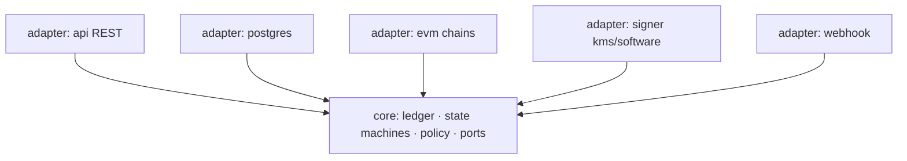
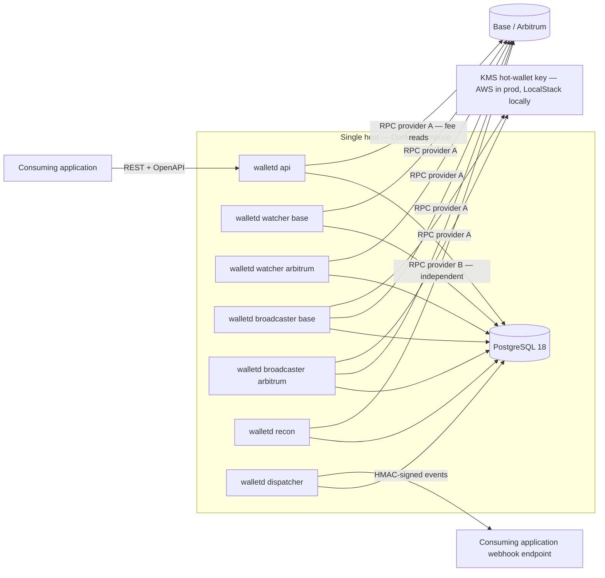
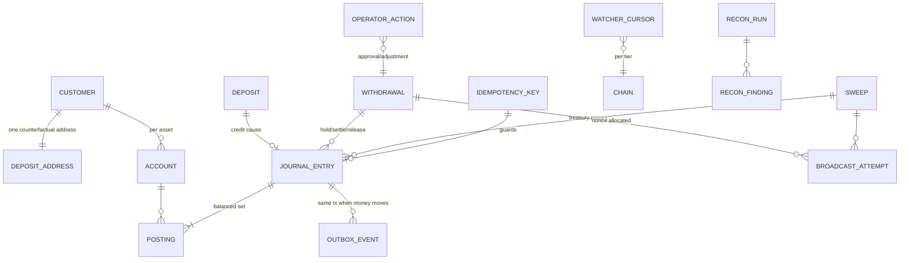

# Architecture Spine — digital-asset-wallet-platform

## Design Paradigm

**Hexagonal (ports & adapters).** The domain core — ledger, deposit/withdrawal/sweep state machines, crediting and withdrawal policy — depends on nothing outside itself and defines the ports; adapters implement them. Inside each adapter, conventional Go layering (handler → service → repository) organizes code. One Go module, one binary (`walletd`) with role subcommands; each role is a separate OS process.



Arrows are the only permitted dependency direction: adapters import core, never each other; core imports no adapter.

## Invariants & Rules

### AD-1 — Chain isolation is structural, not conventional [ADOPTED]

- **Binds:** F10 (FR32–FR34), all
- **Prevents:** chain-specific logic leaking into core or other adapters, failing the FR33 acceptance test
- **Rule:** all chain-specific code (RPC, confirmation-tier mapping, fee mechanics, token contracts, chain IDs) lives under the EVM adapter, keyed by chain configuration. Nothing outside it imports go-ethereum or references a chain ID. Enforced in CI by an import-boundary check.

### AD-2 — One binary, role processes, Postgres as the only shared state [ADOPTED]

- **Binds:** all
- **Prevents:** in-process coupling between API, watchers, and recon; hidden coordination channels that break crash-recovery
- **Rule:** `walletd <role>` roles — `api`, `watcher --chain=<c>`, `broadcaster --chain=<c>`, `recon`, `dispatcher` — run as separate OS processes. They communicate only through PostgreSQL. No process-to-process RPC, no shared memory, no message broker.

### AD-3 — Double-entry ledger; balances are derived [ADOPTED]

- **Binds:** F1 (FR1–FR5), NFR11
- **Prevents:** balance updates that can't be explained against the chain; drift with no arithmetic trail
- **Rule:** every money movement is a journal entry of balanced postings (debits = credits) across the fixed account taxonomy: customer available, customer hold, platform **forwarder-float** (per chain × asset — where credited funds rest until swept), platform treasury, fees. Balances are derived from postings — cacheable, but always recomputable; no code path updates a balance without writing its postings in the same transaction. Every journal entry carries exactly one cause: chain event, internal transfer, or operator adjustment (FR5) — enforced by a unique constraint on `(cause_type, cause_id)`, so the same cause can never produce two entries.

### AD-4 — One transaction per state change, outbox included [ADOPTED]

- **Binds:** all mutating flows (FR15–FR19, FR23–FR24, FR29–FR30), NFR1–NFR2
- **Prevents:** money effects without events, events without money effects, partial writes surfacing after a crash
- **Rule:** every observable state change commits in one PostgreSQL transaction together with its outbox event. Changes that move money (credit, hold, settle, release, internal transfer, sweep, adjustment) additionally carry their balanced journal postings in that same transaction. State-only changes (deposit observed/safe, awaiting-approval entry, recon findings, operational alerts) commit transition + outbox event with no postings. Nothing observable happens outside such a transaction.

### AD-5 — Idempotency by unique constraint, not by care [ADOPTED]

- **Binds:** F7 (FR23–FR24), F3 (FR8, FR14), NFR1
- **Prevents:** double-credits and duplicate withdrawals under retries, redeliveries, and rescans
- **Rule:** the database enforces exactly-once: API mutations dedupe on an idempotency-keys table (unique key, stored response); chain events dedupe on unique `(chain, tx_hash, log_index)`; internal transfers on the caller's key. Retries and over-rescans hit constraint violations, never double-applies. Watcher progress is a persisted cursor per (chain, tier); rescanning from any earlier cursor is harmless by construction.

### AD-6 — Explicit persisted state machines [ADOPTED]

- **Binds:** F3, F4, F5 (FR8, FR16, FR19), NFR2, NFR8
- **Prevents:** ambiguous in-flight states; unresumable work after a crash
- **Rule:** deposits (observed → safe → finalized → credited; orphaned), withdrawals (created → awaiting-approval? → approved → signed → broadcast → confirmed | failed), and sweeps follow explicit state machines persisted in Postgres. The transition functions live once, in core, and are the only write path to machine state — no epic ships its own copy. Each machine's rows have exactly one writing role: **the chain's watcher is the sole writer of deposit rows and executes every deposit transition including the credit's journal entry**; the API role writes withdrawal rows through core; the broadcaster writes broadcast/sweep progress. Every process resumes from persisted state alone.

### AD-7 — Credit only at finalized; credited is irreversible [ADOPTED]

- **Binds:** F3, F4 (FR9, FR13), NFR3
- **Prevents:** double-credit via reorg or sequencer reordering; ad-hoc per-asset crediting logic
- **Rule:** crediting reads a policy table keyed (chain, asset); v1 sets every entry to `finalized`. Pre-finality deposit records are reversible; a credited balance is never reversed by any chain event. Chain history changes only ever affect records below `finalized`.

### AD-8 — Deposit addresses are counterfactual CREATE2 forwarders [ADOPTED]

- **Binds:** F2 (FR6–FR7), F3
- **Prevents:** per-customer key material; per-chain address divergence; broken addresses on chain addition
- **Rule:** deposit address = CREATE2(factory, salt, forwarder init code), where **salt = the customer UUID's 16 bytes left-padded with zeros to bytes32** — pinned exactly, with cross-language test vectors (Go derivation vs Foundry) asserted in CI, because the immutability below makes a divergent first guess permanent. The address is derived once at customer creation, persisted in the address table, and watchers attribute deposits **only via that table, never by re-deriving**. The factory is deployed via the canonical deterministic deployer (`0x4e59b44847B379578588920cA78FbF26c0B4956C`) so it has the same address on every chain; factory address, forwarder init code, and salt scheme are immutable once live — changing any of them changes every customer address. Forwarders are persistent contracts (EIP-6780: no destruct-and-redeploy), modeled on BitGo ForwarderV4 (production-proven; the contracts epic must confirm or commission its audit trail). Bringing up a new chain starts by verifying the deterministic factory deploy. Attribution is always by (address, chain). Funds sent to a customer address on a chain the platform doesn't support are recoverable only where the same factory can be deployed at the same address (EVM-equivalent chains); on chains with divergent CREATE2 semantics they are effectively unrecoverable — a threat-model and consumer-documentation item, not a code path.

### AD-9 — Sweeps are first-class ledger citizens, owned by the broadcaster

- **Binds:** F2, F8, treasury flows
- **Prevents:** on-chain movements invisible to the ledger; duplicate sweeps from competing initiators; sweeps touching customer balances
- **Rule:** a sweep (forwarder deploy + flush to treasury) is a state-machine record with journal postings — no on-chain movement the platform initiates exists outside the ledger. The chain's **broadcaster is the sole creator and owner of sweep records**; a partial unique index permits one in-flight sweep per (chain, forwarder, asset). Sweep postings move platform forwarder-float → platform treasury and **never touch customer accounts** — the customer was credited at finality (AD-7) and sweeping is treasury logistics, invisible to customers. Sweep trigger policy (threshold/schedule) is ops configuration.

### AD-10 — One signing boundary; the key never exists in software [ADOPTED]

- **Binds:** NFR13–NFR14, NFR16, F5
- **Prevents:** key material in process memory, logs, or config; signer code paths diverging between environments
- **Rule:** all signing goes through the core's Signer port. The KMS adapter (`ECC_SECG_P256K1`; DER → r/s, low-s normalization, recovered v — the KMS signer library is vendored, not trusted as a live dependency) is the one implementation used against real AWS KMS in prod and against **LocalStack KMS locally via endpoint override — same adapter, same code path**; unit tests use a plain software signer behind the same port, and the software signer is the documented fallback if LocalStack's secp256k1 Sign emulation gaps. One KMS key = one hot-wallet address, valid on both chains. Raw transactions are constructed and verified by the platform itself (NFR16); key handles and secrets never appear in logs, errors, or API responses. The written threat model (NFR12, a build deliverable) must ratify this mechanism choice — if it surfaces a risk KMS cannot mitigate, this AD is revised, not worked around.

### AD-11 — Single-writer broadcaster per chain

- **Binds:** F5 (FR20), sweeps (AD-9), NFR1
- **Prevents:** nonce races and duplicate broadcasts from concurrent senders sharing the hot wallet
- **Rule:** exactly one broadcaster process per chain sends outbound transactions — withdrawals *and* sweeps — for the hot wallet. Single-writer is enforced at runtime, not by deployment discipline: the broadcaster takes a Postgres advisory lock keyed by chain at startup and exits if it can't; nonces are allocated from persisted per-chain state in the same transaction that records the broadcast attempt. No other code path signs or broadcasts.

### AD-12 — Reconciliation observes independently and never writes the ledger [ADOPTED]

- **Binds:** F8 (FR25–FR28), NFR10, counter-metric 1
- **Prevents:** a lying RPC provider feeding both ledger and check; recon "fixing" what it should be reporting
- **Rule:** the recon process uses a different RPC provider than watchers and broadcasters — configured per role, verified at startup. Recon runs streaming break-detection plus a batch deep pass (daily floor, hourly target) that also checks ledger-internal invariants (journal balance, double-entry integrity, internal-transfer double-counts — FR27), records findings and run history queryably (FR28), and **writes only its own tables plus alert outbox events — never journal, deposit, withdrawal, or sweep rows**; corrections happen only as operator adjustments through the normal audited path. Recon is also the operational monitor: it evaluates watcher cursor lag, chain liveness, stuck withdrawals, and approval-queue age against configured thresholds and raises alert events (NFR17). The test suite seeds deliberate ledger/chain faults and asserts the alarm fires.

### AD-13 — Webhooks ride the outbox [ADOPTED]

- **Binds:** F9 (FR29–FR31), NFR15
- **Prevents:** events lost between commit and delivery; unverifiable or unde-dupable notifications
- **Rule:** the dispatcher is the only webhook sender: it reads outbox rows (written per AD-4), delivers at-least-once with exponential backoff, signs payloads with HMAC-SHA256, and uses the outbox row ID as the consumer-facing event ID.

### AD-14 — REST + OpenAPI, spec-first [ADOPTED]

- **Binds:** API surface (F1, F5, F6, F8 queries; FR10 pending-deposit visibility; all mutations), NFR15
- **Prevents:** drift between documentation and implementation; an API the self-serve vision can't ship
- **Rule:** the API is REST/JSON defined spec-first in OpenAPI; handlers are generated (oapi-codegen, stdlib ServeMux target). Every mutating route requires an `Idempotency-Key` header and authentication; there is no anonymous surface. Unsupported-token observations (FR11) are recorded and operator-visible, never credited.

### AD-15 — Chain liveness loss is a mode, not an incident

- **Binds:** F3, F4, F5 (FR14), NFR9, NFR8
- **Prevents:** each epic inventing its own sequencer-outage behavior (reject vs queue vs crash)
- **Rule:** every chain has an explicit liveness status derived from watcher heartbeat/cursor staleness, exposed through the API. On a degraded chain: deposits stay pending (finality isn't advancing), **withdrawals are accepted and queue** — never rejected for liveness — and the broadcaster holds until liveness returns; recovery is cursor-based rescan (AD-5), unattended. Degradation and recovery raise alert events.

## Consistency Conventions

| Concern | Convention |
| --- | --- |
| Money | Integer base units only (wei; USDC 6-decimal units) — `NUMERIC(78,0)` in Postgres, `*big.Int` in Go; floats never touch money. An asset is identified by (chain, symbol, contract address \| `native`). |
| IDs | UUIDv7 for all entities; event ID = outbox row ID; idempotency keys are opaque caller strings. |
| Time | UTC `timestamptz` in Postgres; RFC 3339 in API and events. |
| Naming | Go packages short/singular; DB tables snake_case plural; state names lowercase-kebab, shared vocabulary across machines (`awaiting-approval`, not per-machine synonyms); webhook event types dot-namespaced (`deposit.credited`, `withdrawal.failed`). |
| Errors | RFC 9457 `application/problem+json`; stable string error codes; problem details never contain key handles or secrets. |
| Logging | `log/slog` structured JSON; every log line about an entity carries its UUID so a deposit is traceable chain event → ledger → webhook from logs alone (NFR18). Operator actions log actor, timestamp, reason (NFR11). |
| Config | 12-factor env vars, prefixed per role; secrets only via environment/AWS-injected material — never in the repo or images. |
| Auth | v1 internal API: static bearer tokens per consumer; webhooks: HMAC-SHA256 signature header + timestamp. |
| Migrations | goose, plain SQL, embedded (`embed.FS`); schema changes only via migration. |
| Testing | Table-driven Go tests; chain behavior tested against anvil (fork mode, `anvil_reorg`) — CI never depends on live testnets; crash-recovery tested by killing processes mid-transition (NFR19). |
| Capacity & latency | The performance envelope is a tested contract, not an aspiration: sized for 10³ deposits+withdrawals/day with 10× burst headroom (NFR4); platform-added credit-path overhead ≤ 1 min (NFR5); read APIs < 500 ms p95 at v1 volume (NFR6). A load-smoke test in CI guards the envelope. |

## Stack

Verified current 2026-07-14; the code owns this once it exists.

| Name | Version |
| --- | --- |
| Go | 1.26.x |
| PostgreSQL | 18 |
| go-ethereum (ethclient) | v1.17.x |
| jackc/pgx | v5 |
| goose (migrations) | v3 |
| oapi-codegen | v2 (OpenAPI 3.0, std-http target) |
| Foundry (forge/anvil) | v1.7.x |
| Solidity | 0.8.36 |
| AWS SDK for Go | v2 (+ KMS `ECC_SECG_P256K1`; signer vendored from matelang/go-ethereum-aws-kms-tx-signer/v2 — small community lib on the custody path, so owned, not depended on) |
| Docker Compose | v5 |
| LocalStack | current (free Hobby plan) — local AWS/KMS emulation via endpoint override; asymmetric keys supported (SM2 the only excluded spec) |
| Chains | Base 8453 / Arbitrum One 42161; testnets Base Sepolia 84532 / Arbitrum Sepolia 421614 |

## Structural Seed

System topology — processes, stores, and external dependencies:



Core entities and relationships:



Source tree (scaffold, not a mirror to maintain):

```text
walletd/
  cmd/walletd/          # single binary; role subcommands (api, watcher, broadcaster, recon, dispatcher)
  internal/core/        # domain: ledger, deposit/withdrawal/sweep machines, policy, ports — imports no adapter
  internal/adapter/
    api/                # REST handlers generated from the OpenAPI spec
    postgres/           # store implementations + goose migrations
    evm/                # chain adapter; per-chain config (tiers, fees: Arbitrum NodeInterface, Base GasPriceOracle)
    signer/             # Signer port impls: kms/, software/
    webhook/            # dispatcher delivery
  contracts/            # Foundry project: forwarder factory + persistent forwarder (BitGo V4 pattern)
  api/openapi.yaml      # the contract; source of truth for generated handlers
  deploy/compose/       # compose stacks: local (with anvil), testnet, prod
  docs/                 # threat model, operator runbook, key ceremony & DR
```

Deployment & environments: **test/CI** = compose stack against anvil (both "chains" simulated, software signer) — deterministic, never dependent on live testnets; **local runtime (v1's operating environment)** = the same compose stack on the developer machine with **LocalStack emulating AWS** (KMS reached through the standard endpoint-override on the same adapter and SDK) and **real testnets** — Base Sepolia + Arbitrum Sepolia (deterministic factory verified live on both) — over two independent RPC providers per AD-12; **prod (graduation shape, not stood up in v1)** = single AWS EC2 instance running the identical compose stack with real AWS KMS. Postgres runs in-stack in every environment, with WAL archiving + scheduled base backups (to S3 or local disk per environment; procedure in the operator runbook — carries NFR2/NFR14).

## Capability → Architecture Map

| Capability | Lives in | Governed by |
| --- | --- | --- |
| F1 Accounts & ledger | core/ledger + adapter/postgres | AD-3, AD-4, AD-5 |
| F2 Address generation | core (salt scheme) + contracts/ | AD-8 |
| F3 Deposit monitoring | watcher role + core/deposit | AD-5, AD-6, AD-7, AD-15 |
| F4 Reorg handling | watcher role + core/deposit | AD-6, AD-7, AD-5, AD-15 |
| F5 Withdrawals | api + broadcaster roles + core/withdrawal | AD-4, AD-6, AD-10, AD-11, AD-15 |
| F6 Fee estimation | adapter/evm per-chain | AD-1 |
| F7 Idempotency | adapter/postgres constraints + api | AD-5 |
| F8 Reconciliation | recon role + core/recon | AD-12 |
| F9 Event notifications | dispatcher role + outbox | AD-4, AD-13 |
| F10 Chain abstraction | adapter/evm boundary | AD-1 |
| Sweeps (derived scope) | broadcaster role + core/sweep + contracts/ | AD-8, AD-9, AD-11 |
| Threat model & runbook | docs/ | AD-10, deployment envelope |

## Deferred

- **Forwarder contract internals** (flush function shape, events, factory access control) — decided in the contracts epic against the BitGo ForwarderV4 reference; the spine fixes only persistence (EIP-6780) and the address-immutability rule (AD-8).
- **RPC provider selection** (which two vendors) — ops choice at deploy time; the spine fixes only that watcher/broadcaster and recon use different providers (AD-12).
- **Operator approval surface** — v1 lean: operator-authenticated routes on the same REST API driven by a small CLI; confirm at epic breakdown. No UI in v1 scope.
- **Alert transport** (where NFR17 alerts land: log-based, email, Slack) — ops choice; the platform's contract is the outbox event + queryable status, not the pager wiring.
- **Fee estimation caching/refresh policy** — implementation detail inside the EVM adapter.
- **Finality detection mechanics per chain** (exact RPC surface for safe/finalized heads) — inside the chain adapter, where AD-1 confines it.
- **Postgres in-stack vs RDS** — revisit trigger: if backup/restore drills fail the NFR2 bar or ops burden grows, move to RDS; the compose choice is not load-bearing for the schema.
- **Multi-tenancy, policy engine, non-EVM chains, external custodian** — future path per PRD; nothing in this spine forecloses them (policy table AD-7, ports AD-10, adapter boundary AD-1 are the extension seams).
