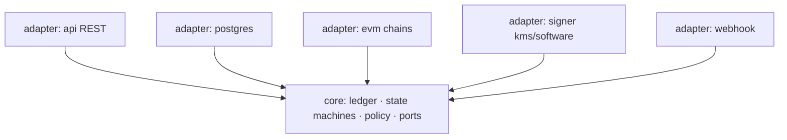
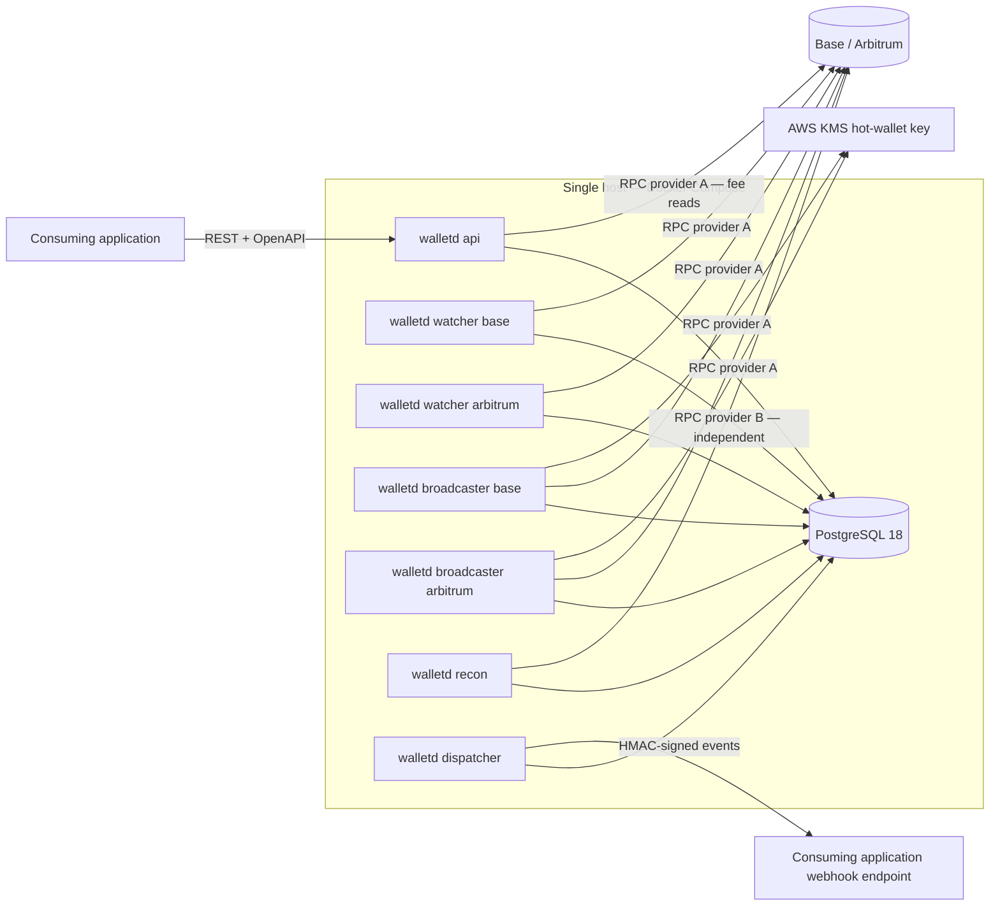
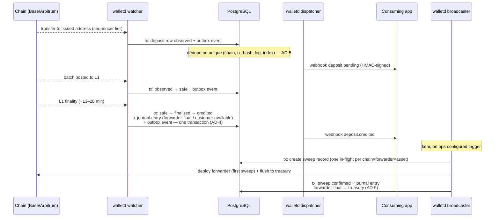

# Solution Design — Digital Asset Wallet Platform

This document is the narrative companion to the [architecture spine](./ARCHITECTURE-SPINE.md). The spine is the contract: a lean set of invariants (AD-1 … AD-15) that every epic must satisfy. This document carries what the spine deliberately omits — the reasoning behind each invariant, the alternatives that were rejected and why, and walkthroughs of the flows the invariants exist to protect. Where the two disagree, the spine wins.

---

## 1. Overview

### What the platform is

A single-tenant backend that lets a consuming application credit customers when crypto arrives and pay out on request, without that application ever thinking about reorgs, gas, or nonces. V1 scope: ETH and USDC on Base and Arbitrum, one Go service (`walletd`), platform-held keys, one internal API consumer, one operator role.

The platform is deliberately the **ledger side** of wallet infrastructure — deposit monitoring, reorg handling, transaction state machines, reconciliation — the layer the PRD identifies as the one no vendor or mature OSS project covers, and the one every company in this position ends up building by hand. Key custody and signing are commodity by comparison; orchestration is the product.

### The four hard problems

The PRD's Problem & Context section names four backend problems, each with a real-cost failure mode. They shape everything downstream:

1. **Deposits are not binary.** On L2s a transaction passes through confirmation tiers — sequencer receipt (~200 ms–2 s, reorderable), *safe* (batch posted to L1), *finalized* (L1 finality, ~13–20 min). Credit too early and a reorg or sequencer reordering becomes a double-credit.
2. **Withdrawals must never happen twice.** Retries, crashes, and duplicate API calls are normal operation. Without idempotency and an explicit state machine, they become duplicate payouts.
3. **Fees are chain-specific.** L2 fees combine an execution fee with an amortised L1 data fee, surfaced differently on Arbitrum (`NodeInterface.gasEstimateComponents()`) and Base (the GasPriceOracle predeploy). Naive L1-style estimation systematically undercharges.
4. **The ledger drifts from the chain.** Missed deposits, stuck withdrawals, double-counted internal transfers. Without *independent* reconciliation, drift is discovered by customers, not operators.

### Design goals

Derived directly from the PRD's success metrics and non-negotiable NFRs:

- **Correctness over availability.** Zero double-credits and zero duplicate withdrawals under injected faults (NFR1); no acknowledged data ever lost (NFR2); a credited balance is never reversed by a chain event (NFR3). Availability, by contrast, is explicitly best-effort on a single instance (NFR7). The whole architecture leans into this asymmetry: it buys correctness cheaply by refusing to pay for high availability.
- **Explainability as an arithmetic identity.** Every balance change traceable to exactly one cause (FR5), the audit trail append-only (NFR11), a deposit traceable chain event → ledger → webhook from logs alone (NFR18).
- **Failure as a mode, not an incident.** Sequencer halts, RPC failures, and process crashes are expected operating conditions (NFR8, NFR9); recovery is unattended wherever possible.
- **Extension seams without speculative generality.** Adding a third EVM chain touches only the chain adapter (FR33); adding a token is configuration (FR34); a tiered crediting policy is a config change (FR9). Multi-tenancy, policy engines, and non-EVM chains are out of v1 but must not be foreclosed.
- **The repository is a deliverable.** This is a portfolio effort run like a product: the stated bet is that there is no technical moat, and rigor — tests, a reviewed threat model, correct L2 mechanics — is the product. That is why the test suite (NFR19) and the threat model (NFR12) have the same status as code.

---

## 2. Architecture at a glance

### Paradigm: hexagonal, with conventional layering inside adapters

The system is **hexagonal (ports & adapters)**. The domain core — ledger, deposit/withdrawal/sweep state machines, crediting and withdrawal policy — depends on nothing outside itself and defines the ports; adapters (REST API, Postgres, EVM chains, signer, webhook delivery) implement them. Inside each adapter, conventional Go layering (handler → service → repository) organises the code; the hexagon governs only dependency *direction*, not internal file structure.



Arrows are the only permitted dependency direction: adapters import core, never each other; core imports no adapter. This is enforced in CI by an import-boundary check, because the single most valuable structural property here — chain isolation (AD-1, FR32–FR34) — dies by a thousand convenient imports if it is merely conventional.

### One binary, many roles

The whole platform is one Go module and one binary, `walletd`, with role subcommands. Each role runs as a **separate OS process** (AD-2):

| Role | Instances | Responsibility |
| --- | --- | --- |
| `api` | 1 | REST surface: accounts, balances, history, withdrawals, fee estimates, recon status |
| `watcher --chain=<c>` | 1 per chain | Observes deposits across confirmation tiers; sole writer of deposit rows, including the credit |
| `broadcaster --chain=<c>` | 1 per chain | Sole sender of outbound transactions — withdrawals *and* sweeps — for the hot wallet |
| `recon` | 1 | Independent ledger-vs-chain reconciliation plus operational monitoring |
| `dispatcher` | 1 | Delivers outbox events as HMAC-signed webhooks |

The processes share exactly one thing: PostgreSQL. There is no process-to-process RPC, no shared memory, no message broker. Every coordination primitive the system needs — work queues, cursors, locks, events — is a Postgres construct, which means every process can crash and resume from persisted state alone.

### System topology



Two details of this picture are load-bearing and easy to miss. First, **recon uses a different RPC provider** than everything else (AD-12) — the independence is in the diagram, not just in prose. Second, **only broadcasters talk to KMS**: the signing boundary has exactly two client processes, one per chain.

---

## 3. Design decisions, with the alternatives rejected

The spine records the rules; this section records the arguments. Each of these was a deliberate trade-off, made and logged during the architecture session (the memlog is the primary record).

### 3.1 Hexagonal over plain layering; journal-first over event sourcing

A conventional layered Go service (handler → service → repository, one big module) would have been the path of least resistance, and its vocabulary is in fact retained *inside* each adapter. What plain layering cannot do is make chain isolation structural: nothing in a layered architecture stops a service function from importing go-ethereum "just this once", and the FR33 acceptance test — adding a third chain touches only the adapter — fails by erosion. Hexagonal makes the dependency direction the rule, and the CI import check makes the rule mechanical (AD-1).

Full event sourcing — the whole system as an event log with projected state — was not adopted either. The system takes the one property of event sourcing that matters for money and leaves the rest: **balances are derived from an append-only journal of balanced postings and are always recomputable** (AD-3), so FR5's "explainable against the chain" becomes an arithmetic identity rather than a discipline. Everything else uses explicit persisted state machines with plain relational rows (AD-6), because a wallet's operational questions — "which withdrawals are stuck in `broadcast`?" — are state queries, and answering them through event replay adds machinery without adding correctness.

### 3.2 Separate processes over goroutines

The obvious cheap alternative was one process with watcher and recon goroutines inside the API server. It was rejected (memlog, user decision) because in-process coupling creates exactly the hidden coordination channels that break crash recovery: shared in-memory state that dies with the process, lifecycle entanglement (an API panic taking the watchers down), and the temptation to pass work through channels instead of durable state. Separate OS processes with Postgres as the only shared state (AD-2) force every hand-off to be persisted — which is precisely the property NFR2 and NFR8 require. The cost — a compose stack of seven containers instead of one — is trivial at this scale.

### 3.3 Postgres as the sole store and coordination point

One PostgreSQL instance is the durable store, the work queue, the event outbox, the lock manager, and the cursor store. Alternatives — a message broker for events, Redis for locks, a separate queue for webhook delivery — were not taken, for one central reason: **the transactional outbox only works if the outbox lives in the same database as the money** (AD-4). The moment events travel through a second system, "state change and event commit atomically" becomes a distributed-transaction problem the platform would have to solve badly. At 10³ operations/day with 10× burst headroom (NFR4), Postgres is nowhere near any limit that would justify that complexity, and a CI load-smoke test guards the envelope rather than trusting the estimate.

### 3.4 Double-entry ledger over balance columns

A `balance` column updated in place is simpler to write and impossible to audit: when it drifts, there is nothing to explain the drift against. The double-entry journal (AD-3) makes every movement a balanced set of postings with exactly one cause — chain event, internal transfer, or operator adjustment (FR5) — enforced by a unique constraint on `(cause_type, cause_id)` so the same cause can never produce two entries. Balances are derived (cacheable, but always recomputable), and reconciliation gains a second, internal check for free: the journal must balance, always, independent of any chain data (FR27). §4 develops the account taxonomy.

### 3.5 CREATE2 counterfactual forwarders over HD-wallet sweeps

The classic exchange pattern is an HD wallet: derive a per-customer key from a master seed, watch its addresses, sweep with per-address signatures. It was rejected for three reasons (memlog, user decision):

- **Key inventory.** HD wallets mean per-customer key material and sweep-signing keys derived from a master seed — a large, hot, high-value key surface. With CREATE2 forwarders, **no per-customer key exists at all**: a deposit address is just the counterfactual address of a not-yet-deployed contract, `CREATE2(factory, salt, init code)` with salt = the customer UUID left-padded to bytes32 (AD-8). The entire signing inventory of the system collapses to one hot-wallet key — which is what makes clean KMS custody possible (§3.6).
- **Cross-chain address equality.** FR6 (overturned assumption A2) requires one address per customer, identical on every supported EVM chain. CREATE2 delivers this provided the factory sits at the same address everywhere, which the canonical deterministic deployer (`0x4e59b44847B379578588920cA78FbF26c0B4956C` — Foundry's default, a genesis preinstall on Base, long-deployed on Arbitrum, listed ecosystem-critical by RIP-7740) guarantees. Adding a chain requires no address migration: existing customer addresses are valid there from day one.
- **No funds at rest under weak keys.** Deposits land in a contract that can only flush to treasury, not in an EOA whose key must be protected forever.

The costs were accepted knowingly. The project gains a small Solidity surface (factory + forwarder) it must treat with audit-grade care — mitigated by modelling on BitGo's production-proven, multiply-audited ForwarderV4, with confirmation of its audit trail pushed to the contracts epic. EIP-6780 (live on both chains) killed the old deploy-flush-selfdestruct gas pattern, so forwarders are persistent contracts. And the scheme is brutally immutability-sensitive: factory address, init code, and salt derivation change *every customer address* if touched, so AD-8 pins the salt exactly and requires cross-language test vectors (Go vs Foundry) in CI, with watchers attributing deposits only via the persisted address table, never by re-derivation. Finally, the addendum's original claim about recovering funds sent to unwatched chains had to be corrected as a ripple of this decision (§7).

### 3.6 AWS KMS over software keys or an HSM

With the key inventory reduced to one hot-wallet key, the mechanism question (PRD open question 1) resolves cleanly. Software keys put secp256k1 material in process memory, config, and backups — the exact exposure NFR13 forbids. A dedicated HSM is the gold standard but carries procurement, ceremony, and operational weight far beyond a single-instance v1. AWS KMS with `ECC_SECG_P256K1` sits in the middle: the private key never leaves the HSM-backed service, signing is an API call, and the verified numbers (memlog, 2026-07-14) — roughly $0.15 per 10k signatures, $1/month/key, 300–1000 req/s quota — are trivially within v1 volume.

Two honesty clauses attach. The DER→r/s conversion, low-s normalisation (EIP-2), and v-recovery glue comes from a small community library (matelang/go-ethereum-aws-kms-tx-signer/v2); a small library on the custody path is **vendored and owned, not trusted as a live dependency** (AD-10, Stack). And AD-10 carries an explicit ratification clause: the written threat model (NFR12) must ratify KMS as the mechanism (§7). The decision is made, but it is made falsifiable.

### 3.7 REST + OpenAPI over gRPC

gRPC was considered and rejected for v1 (memlog): the first consumer's identity is unconfirmed (PRD open question 2), the self-serve-adoption vision makes the OpenAPI document itself the product documentation, and webhooks are already JSON-over-HTTP — a second protocol buys type safety the platform does not need at one internal consumer, at the cost of a toolchain and a documentation split. The API is spec-first: `api/openapi.yaml` is the source of truth and handlers are generated (oapi-codegen v2, stdlib `ServeMux` target), so documentation drift is structurally impossible (AD-14). Every mutating route requires an `Idempotency-Key` header and authentication; there is no anonymous surface (NFR15). The router is the standard-library ServeMux — mainstream since Go 1.22 — with chi held in reserve only if middleware needs grow.

### 3.8 RPC-provider independence for reconciliation

The subtlest decision, and per the memlog a user-stated hard requirement: **reconciliation must use a different RPC provider than the watchers and broadcasters, or recon-green is meaningless** (AD-12). If the same provider feeds both the ledger and the check, a lying or lagging provider corrupts both identically and reconciliation passes while funds drift. Running own nodes was ruled out of v1 scope; two managed providers, configured per role and verified at startup, buy genuine observation independence at the cost of a second vendor bill. Which two vendors is deliberately deferred to deploy time — the spine fixes only the independence property.

---

## 4. The money model

### Account taxonomy

Every money movement is a journal entry of balanced postings (debits = credits) across a fixed taxonomy (AD-3):

| Account | Meaning |
| --- | --- |
| Customer available | Spendable balance, per customer × asset |
| Customer hold | Reserved for in-flight withdrawals (FR15) |
| Platform forwarder-float | Per chain × asset: value credited to customers but physically still sitting in forwarder contracts, not yet swept |
| Platform treasury | The hot wallet's holdings |
| Fees | Fee postings |

**Forwarder-float is the account that makes the CREATE2 model honest.** A customer is credited at finality (AD-7), but the coins are still in their forwarder contract on-chain — possibly for days, until a sweep is economic. Without a float account, the ledger would either lie about where funds are or delay crediting until sweep. With it, the ledger states the truth at every moment: the customer's claim exists, and the backing value is at a known on-chain location. It also yields the crucial separation in AD-9: **sweep postings move forwarder-float → treasury and never touch customer accounts** — sweeping is treasury logistics, invisible to customers, so a failed or delayed sweep can never disturb a balance.

All amounts are integer base units (wei; USDC 6-decimal units): `NUMERIC(78,0)` in Postgres, `*big.Int` in Go. Floats never touch money.

### The life of a deposit

States: `observed → safe → finalized → credited`, with `orphaned` as the reorg exit (FR8). The chain's watcher is the **sole writer** of deposit rows and executes every transition, including the credit's journal entry (AD-6) — one writer, no races.



Narrated:

1. **Observed.** The watcher sees a transfer to an issued address — attribution strictly via the persisted address table, keyed (address, chain), never by re-derivation and never by address alone (AD-8, FR6). The deposit row commits with its outbox event; the application can already see it as pending with its current tier (FR10). The unique constraint on `(chain, tx_hash, log_index)` means the same on-chain event can never create two rows, no matter how many times a rescan revisits the range (AD-5).
2. **Safe.** The batch lands on L1; a state-only transition (no postings) commits with its event.
3. **Finalized → credited.** L1 finality is the crediting tier for every (chain, asset) in v1 — read from a policy table, not hard-coded, so a future tiered policy is configuration (AD-7, FR9). The credit is one Postgres transaction: state transition, balanced journal entry (forwarder-float and customer available), outbox event. The `(cause_type, cause_id)` uniqueness makes a second credit for the same deposit a constraint violation, not a bug class (AD-3). From this commit onwards the balance is irreversible by any chain event (NFR3). Platform-added latency from finality observed to webhook sent is bounded at one minute (NFR5) — the customer wait is dominated by the finality policy itself.
4. **Swept.** At some later point, on an ops-configured threshold or schedule, the broadcaster — the sole creator and owner of sweep records (AD-9) — deploys the forwarder (first sweep pays the deployment gas) and flushes to treasury. A partial unique index allows one in-flight sweep per (chain, forwarder, asset), so competing sweep initiators cannot exist even under bugs. The confirmed sweep posts forwarder-float → treasury. The customer notices nothing, because there is nothing for them to notice.

Unsupported tokens sent to an issued address are recorded and operator-visible, never credited (FR11, AD-14) — they must not corrupt the ledger, and they do not enter it as money.

### The life of a withdrawal

States: `created → awaiting-approval? → approved → signed → broadcast → confirmed | failed` (FR16). The API role writes withdrawal rows through core; the broadcaster writes broadcast progress (AD-6).

```mermaid
sequenceDiagram
    participant App as Consuming app
    participant A as walletd api
    participant PG as PostgreSQL
    participant Op as Operator
    participant B as walletd broadcaster
    participant K as AWS KMS
    participant C as Chain
    participant D as walletd dispatcher

    App->>A: POST withdrawal (Idempotency-Key)
    A->>PG: tx: withdrawal created + hold journal entry<br/>(available → hold, FR15) + idempotency row + outbox
    Note over PG: duplicate key ⇒ stored response returned,<br/>no second money movement (FR23)
    alt amount above per-asset threshold (FR17)
        A->>PG: tx: → awaiting-approval + outbox
        D->>App: webhook approval required
        Op->>A: approve (authenticated; actor/timestamp/reason logged, NFR11)
        A->>PG: tx: → approved + outbox
    end
    B->>PG: claim approved withdrawal (advisory-locked single writer, AD-11)
    Note over B: policy validation before signing (FR18):<br/>balance covers amount+fee, destination well-formed
    B->>PG: tx: allocate nonce from persisted per-chain state<br/>+ broadcast_attempt row — same transaction
    B->>K: sign raw tx (constructed & verified by platform, NFR16)
    B->>C: broadcast
    B->>PG: tx: → broadcast + outbox
    C-->>B: transaction confirmed
    B->>PG: tx: → confirmed + settle journal entry + outbox
    D->>App: webhook withdrawal confirmed
```

Narrated:

1. **Created, hold taken.** The request carries a mandatory idempotency key (FR15, AD-14). In one transaction: withdrawal row, hold entry moving the amount from customer available to customer hold, the idempotency-key row with the stored response, and the outbox event. A retry — from the app, a proxy, or a crash-replay — hits the unique key and gets the original response back; the money moved once (FR23–FR24).
2. **Approval, when required.** Above the configurable per-asset threshold, the withdrawal parks in `awaiting-approval` and an approval-required event fires (FR17). Approval-queue age is one of recon's monitored thresholds (NFR17, PRD counter-metric 2) — the queue cannot silently pile up. Operator approval is logged with actor, timestamp, and reason (NFR11).
3. **Validated, signed, broadcast.** The chain's broadcaster — provably the only sender, because it holds a Postgres advisory lock keyed by chain and exits if it cannot acquire it (AD-11) — validates the v1 policy set (FR18), allocates the next nonce from persisted per-chain state *in the same transaction that records the broadcast attempt*, constructs the raw transaction itself, verifies it, and signs via the KMS Signer port. The consuming application never sees nonces, gas, or raw transactions (FR20).
4. **Confirmed or failed.** On confirmation, the settle entry extinguishes the hold against platform treasury and the terminal event fires. Terminal failure releases the hold back to available in its own atomic transaction; a withdrawal stuck in-flight is surfaced to the operator with a documented resolution path in the runbook (FR19).

Internal transfers (FR4) are the degenerate case: a single balanced journal entry between two customers' available accounts, idempotent on the caller's key, no chain involvement at all.

---

## 5. Correctness machinery — how exactly-once actually happens

NFR1 (zero double-credits, zero duplicate withdrawals) and NFR2 (no acknowledged data lost, no ambiguous in-flight state) are not properties the code tries hard to maintain; they are properties the schema makes hard to violate. The package has five interlocking parts — designed together, because each closes a hole the others leave.

**1. One transaction per state change, outbox included (AD-4).** Every observable state change commits in a single Postgres transaction with its outbox event; money-moving changes additionally carry their balanced postings in the same transaction. This kills the classic dual-write bug in both directions: there can be no credited balance whose event was lost (webhook silence hiding money), and no event describing money that never moved. A crash at any instant leaves the database either before the transaction or after it — never between "money" and "the record of money". This is most of NFR2 by itself: an acknowledged write *is* a committed transaction, and a committed transaction is the only kind of acknowledgement that exists.

**2. Idempotency by unique constraint, not by care (AD-5).** Deduplication is never an application-level `if exists` check, because check-then-insert races and code paths get forgotten. It is a database constraint at each entry point: API mutations dedupe on the idempotency-keys table (unique key, stored response); chain events on `(chain, tx_hash, log_index)`; internal transfers on the caller's key; journal entries themselves on `(cause_type, cause_id)`. Retries, webhook-of-a-webhook redeliveries, and over-eager rescans hit constraint violations — a handled, boring outcome — never double-applies. Given part 1, "at-least-once delivery, exactly-once effect" (FR24) falls out: any duplicate attempt to commit the same cause fails atomically.

**3. Persisted state machines with single writers (AD-6).** Deposits, withdrawals, and sweeps advance only through transition functions that live once, in core — no epic ships its own copy of "mark credited". Each machine's rows have exactly one writing role (watcher for deposits, api-through-core for withdrawals, broadcaster for broadcast/sweep progress), so write-write races between processes are impossible by assignment, not by locking discipline. Every process resumes from persisted state alone — the operational meaning of NFR8's "no operator reconstruction of state is ever required".

**4. Single-writer broadcaster with transactional nonces (AD-11).** Nonce management is the one place where the chain itself punishes concurrency: two senders sharing a hot wallet produce nonce races and duplicate broadcasts. Exactly one broadcaster per chain sends *all* outbound transactions — withdrawals and sweeps through the same funnel — and single-writer is enforced at runtime by a Postgres advisory lock, not by deployment discipline ("we only run one" is not an invariant; "a second one cannot start" is). Nonces come from persisted per-chain state allocated in the same transaction that records the broadcast attempt, so a crash between allocation and broadcast leaves a resumable record, never a mystery gap.

**5. Persisted cursors, harmless rescans (AD-5).** Watcher progress is a cursor per (chain, tier). Recovery from any outage — process crash, RPC failure, sequencer halt — is "rewind the cursor and rescan", and because every event the rescan re-encounters dedupes on its constraint, over-rescanning is harmless *by construction* (FR14). The recovery procedure needs no cleverness, which is exactly what you want in a procedure that runs after failures.

The claims are tested the way they are stated: the suite injects reorgs (anvil fork mode + `anvil_reorg`), duplicate requests, RPC failures, and kills processes mid-transition (NFR19). CI never depends on live testnets — a lesson reinforced by Arbitrum Sepolia's March 2026 consensus-failure outage.

---

## 6. Failure and degraded modes

### Reorgs and history changes

The reorg defence is structural: crediting waits for L1 finality (AD-7, FR9), so the records a reorg can touch are, by definition, below `finalized` — and those are designed to be reversible. When observed history changes (sequencer reordering pre-inclusion, or an L1 reorg affecting batch inclusion, FR12), affected pre-finality deposits move to `orphaned` or are re-observed under the new history (FR13). A credited balance is never reversed by any chain event — the platform invariant NFR3, which holds not because reorg handling is clever but because credit timing makes deep-reorg exposure a policy choice rather than a race. The addendum's research grounds the policy: no major exchange credits at sequencer tier, Base's early Flashblocks produced tail-flashblock reorgs, and Gate.io's finality-wait policy is the closest public precedent to ours.

### Sequencer halts: a mode, not an incident (AD-15)

Base's own outage history (June 2026: back-to-back 116 min + 20 min halts; August 2025; September 2024) and Arbitrum's December 2023 inscription-surge outage make liveness loss an *expected operating condition* (NFR9). AD-15 exists to stop each epic inventing its own outage behaviour. Every chain carries an explicit liveness status derived from watcher heartbeat/cursor staleness, exposed through the API. On a degraded chain:

- **Deposits stay pending** — finality is not advancing, so nothing credits; nothing is lost.
- **Withdrawals are accepted and queue** — never rejected for liveness. The broadcaster holds until liveness returns. (The PRD's NFR9 allowed queue *or* reject; the architecture resolved the fork to queue, on the grounds that a liveness blip should not surface as a customer-visible error, and the decision was flagged back to the PRD owner.)
- **Recovery is unattended:** cursor-based rescan (AD-5), with degradation and recovery both raising alert events.

### Crash recovery

Any process can be killed at any instant. Because every observable change is one transaction (AD-4) and every machine resumes from persisted state (AD-6), recovery is universally "restart the process": watchers resume from cursors, the broadcaster resumes from the last recorded broadcast attempt and its persisted nonce state, the dispatcher re-reads undelivered outbox rows (at-least-once delivery with consumer-side dedupe on the event ID, FR30). NFR19's kill-mid-transition tests exist to keep this claim honest rather than aspirational.

### Reconciliation as the independent check

Reconciliation is the system's answer to the fourth hard problem (§1), and its design is dominated by one principle: **the check must not share fate with the thing checked.** Hence a different RPC provider (AD-12, §3.8), and hence the read-only rule: recon writes only its own tables and alert outbox events — never journal, deposit, withdrawal, or sweep rows. If recon could "fix" drift, a recon bug becomes a ledger corruption channel and its findings stop being evidence; corrections happen only as operator adjustments through the normal audited path (FR5, NFR11).

Recon runs in two modes (NFR10): streaming break-detection as events flow, plus a batch deep pass (daily floor, hourly target) that compares full ledger state against the chain *and* checks ledger-internal invariants — journal balance, double-entry integrity, internal-transfer double-counts (FR27) — with status and run history queryable so "reconciliation is green" is an observable fact (FR28). Recon also owns operational monitoring: watcher cursor lag, chain liveness, stuck withdrawals, approval-queue age, each against configured thresholds (NFR17). And because "green because it checks nothing" is the PRD's named counter-metric, the test suite seeds deliberate ledger/chain faults and asserts the alarm fires.

---

## 7. Security posture

### One signing boundary

All signing crosses exactly one port: the core's Signer interface (AD-10). Production implements it with AWS KMS (`ECC_SECG_P256K1`); dev and test with a software signer behind the same port, so the signing code path never forks between environments. The key never exists in software: no process memory, no config file, no backup contains it (NFR13). Key handles and secrets never appear in logs, errors, or API responses — and the RFC 9457 problem-details convention explicitly excludes them. One KMS key = one hot-wallet address, valid on both chains, with nonce state kept per chain. Key generation, backup, and recovery are documented, tested procedures (key ceremony and DR in `docs/`), because loss of a single host must never mean loss of funds (NFR14) — note that with CREATE2 forwarders, customer deposit addresses involve no key material at all, so the ceremony covers one key.

### The Bybit lesson (NFR16)

The February 2025 Bybit incident (~$1.5B) was not a key compromise — it was a Safe{Wallet} front-end supply-chain compromise: signers approved transactions a third-party UI misrepresented. The platform's response is architectural: **raw transactions are constructed and verified by the platform itself; no third-party signing UI exists in the path.** The broadcaster builds the transaction, checks it against the withdrawal record, and only then requests a signature. In the same spirit, the one third-party component on the custody path — the community KMS-signing library — is vendored and owned rather than consumed as a live dependency, closing the supply-chain channel at the point it matters most.

### The threat model is upstream of the mechanism, formally

NFR12 makes the written threat model a deliverable with the same status as code, and AD-10 encodes an unusual and deliberate humility clause: the threat model must *ratify* the KMS choice, and if it surfaces a risk KMS cannot mitigate, **the AD is revised, not worked around**. The mechanism decision was made with the best information available (verified capabilities, costs, quotas), but the document that exists to challenge it retains the authority to overturn it. Incident references for that review — Bybit, the ETC 51% reorgs, the Base outage history — are already catalogued in the PRD addendum.

### The unwatched-chain caveat

An honestly stated sharp edge. A customer's deposit address is a valid address on *every* EVM chain — including chains the platform does not watch (Ethereum L1, Optimism, Polygon, …). Funds sent there are not observed and not credited. Recovery is possible only where the same deterministic factory can be deployed at the same address — EVM-equivalent chains; on chains with divergent CREATE2 semantics (zkSync-style), such funds are **effectively unrecoverable** (AD-8). This is a threat-model and consumer-documentation obligation, not a code path: the supported-chain boundary must be stated explicitly to consumers, alongside FR11's unsupported-token case. (The PRD addendum originally overstated recoverability here; it was corrected as a ripple of the CREATE2 decision, and the correction is logged in both memlogs.)

One further chain-level subtlety from the decision record: EIP-7702 is live on both chains, so deposit senders may be EOAs with delegated code — deposit attribution therefore uses no `EXTCODESIZE`/`tx.origin` heuristics anywhere. Attribution is by issued address and nothing else.

### Surface and auth

The internal API has no anonymous surface: static bearer tokens per consumer in v1 (NFR15). Webhooks are HMAC-SHA256-signed with a timestamp header, and the outbox row ID doubles as the consumer-facing event ID for dedupe (FR30–FR31, AD-13). Secrets arrive only via environment/AWS-injected material — never in the repository or images.

---

## 8. Deployment and operations

### One compose stack, three environments

The deployment unit is Docker Compose, and the same stack definition runs everywhere — which is itself a correctness feature, since environment-specific topology is a class of bug the project refuses to own:

- **test/CI** — full stack against anvil (both "chains" simulated; fork mode and `anvil_reorg` provide deterministic fault injection), software signer. CI never depends on live testnets.
- **local runtime — v1's operating environment** — the same stack on the developer machine, with **LocalStack emulating AWS**: the KMS adapter reaches LocalStack through the SDK's standard endpoint override, so the KMS code path is exercised locally, not mocked around. Chains are the **real testnets** — Base Sepolia (84532) and Arbitrum Sepolia (421614), where the deterministic CREATE2 factory deployer is verified live — over two independent RPC providers per AD-12. The software signer remains the documented fallback should LocalStack's secp256k1 signing emulation gap.
- **prod (graduation shape, not stood up in v1)** — a single AWS EC2 instance running the identical stack with real AWS KMS and the same two-provider RPC split.

Single-instance is a deliberate posture, not an oversight: NFR7 says availability is best-effort and durability is the SLA. The platform buys its correctness properties (single-writer broadcaster, one Postgres, advisory locks) partly *because* it declines to be distributed in v1.

### Durability duty: backup and DR

Postgres runs in-stack (not RDS), with a volume, WAL archiving, and scheduled base backups (to S3 in prod, local disk or LocalStack S3 locally). The procedure lives in the operator runbook and **carries NFR2 and NFR14** — it is load-bearing, not hygiene: "no acknowledged data ever lost" and "loss of a host never means loss of funds" are only true if restore actually works. The spine records an explicit revisit trigger: if backup/restore drills fail the NFR2 bar or the ops burden grows, Postgres moves to RDS — and the compose choice is deliberately not load-bearing for the schema, so that move is operational, not architectural.

### Alerting ownership

Alerting has a clean split of responsibility. The **recon process owns detection**: reconciliation drift, watcher cursor lag, chain liveness, stuck withdrawals, approval-queue age — evaluated against configured thresholds, raised as alert outbox events, with status queryable (NFR17, AD-12). The **platform's contract ends at the outbox event and the queryable status**; where alerts land (log-scraping, email, Slack) is deliberately an ops choice, deferred. The operator-facing goal is the PRD's: the operator hears it from the platform first. Threshold *values* (approval threshold per asset, watcher-lag ceiling, approval-queue age ceiling) are flagged as pre-launch checklist items (PRD open question 3).

Operationally, everything is 12-factor: env-var config prefixed per role, structured `log/slog` JSON where every entity-touching line carries its UUID — so a deposit is traceable chain event → ledger → webhook from logs alone (NFR18). Schema changes happen only via goose migrations, embedded in the binary.

---

## 9. What we deliberately deferred

Each deferral is recorded in the spine with the invariant that survives it — deferring the detail never means deferring the rule.

| Deferred | Why, and what is already fixed |
| --- | --- |
| **Forwarder contract internals** (flush shape, events, factory access control) | Decided in the contracts epic against the BitGo ForwarderV4 reference, where the Solidity work has full attention — including confirming or commissioning the audit trail. The spine already fixes what cannot wait: persistence (EIP-6780) and address immutability (AD-8). |
| **RPC provider selection** (which two vendors) | An ops choice at deploy time; vendors churn, the property does not. The spine fixes only that watcher/broadcaster and recon use *different* providers (AD-12). |
| **Operator approval surface** | v1 stays lean: operator-authenticated routes on the same REST API driven by a small CLI, confirmed at epic breakdown. No UI in v1 scope — the PRD excludes consumer-facing UI, and an ops UI would be scope without a user. |
| **Alert transport** (log/email/Slack) | The platform's contract is the outbox event plus queryable status, not the pager wiring — transport is an ops decision that can change without touching the system. |
| **Fee-estimation caching/refresh policy** | Implementation detail inside the EVM adapter; the requirement (correct two-component L2 fees, FR21–FR22) is fixed, the freshness tuning is not. |
| **Finality-detection mechanics per chain** (exact RPC surface for safe/finalized heads) | Precisely the kind of chain-specific knowledge AD-1 confines to the adapter; deciding it centrally would violate the boundary the decision exists to protect. |
| **Postgres in-stack vs RDS** | Deferred with an explicit revisit trigger: failed backup/restore drills against the NFR2 bar, or growing ops burden. The schema is deliberately independent of the answer. |
| **Multi-tenancy, policy engine, non-EVM chains, external custodian** | Future path per the PRD, not v1. Nothing in the spine forecloses them — the extension seams are already load-bearing for v1: the crediting policy table (AD-7), the Signer port (AD-10), and the chain-adapter boundary (AD-1). The PRD's standing trigger also applies: if the product path reaches customers whose compliance posture demands a qualified custodian, platform-held keys is re-opened — the orchestration core remains the product either way. |

---

*End of solution design. The spine remains the contract; changes to any AD go through the spine and its memlog, and this document follows.*
